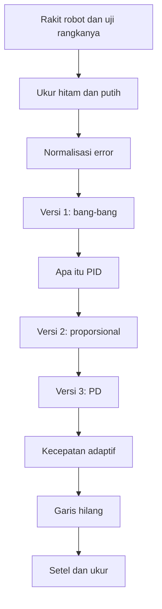
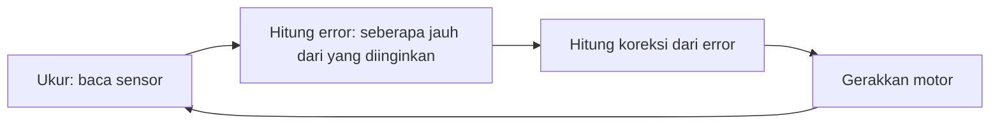
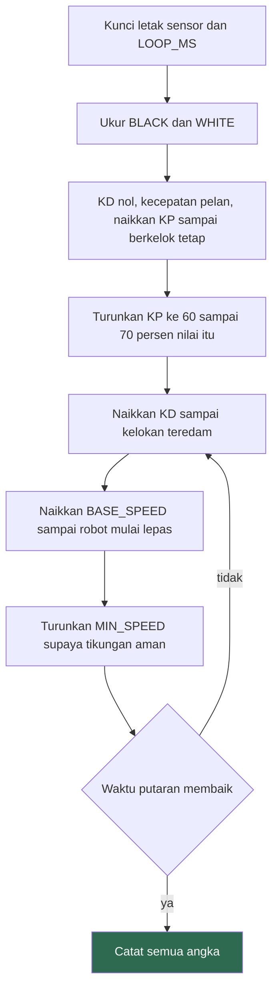

# Membuat Pengikut Garis Sendiri

Dokumen ini membangun satu pengikut garis dari nol, mulai dari merakit rangkanya, lalu mengukur sensor, sampai menyetel penguatan. Kodenya kalian tulis bertahap, dan setiap tahap memperbaiki kelemahan tahap sebelumnya.

Bagian 11.2 di `dasar-pybricks.md` memberi kalian program pengikut garis yang sudah jadi. Dokumen ini membongkarnya. Kalau kalian hanya menyalin program itu lalu mengubah satu angka sampai kebetulan jalan, tidak ada yang bisa kalian pakai lagi di robot berikutnya.

Selesaikan `dasar-pybricks.md` sampai bagian 11 dulu.
## Peta materi



Kerjakan berurutan, dan jalankan setiap versi di lintasan sungguhan sebelum lanjut. Versi yang dilewati tidak bisa kalian bandingkan nanti.

## 1. Cara kerja pengikut garis satu sensor

Satu Color Sensor tidak bisa tahu robot ada di kiri atau kanan garis. Yang dia laporkan cuma satu angka pantulan. Angka yang sama, misalnya 45, bisa berarti robot sedikit ke kiri atau sedikit ke kanan.

Karena itu robot tidak mengikuti tengah garis. Robot mengikuti satu tepi garis.

```
   putih          garis hitam         putih
  pantulan 85      pantulan 9       pantulan 85

  ################|||||||||||||||################
                  ^
                  tepi kiri, pantulan sekitar 47
                  di sinilah sensor dijaga
```

Di tepi, sebagian lingkaran pandang sensor kena hitam dan sebagian kena putih, jadi pantulannya di tengah-tengah. Begitu sensor bergeser ke putih angkanya naik, begitu bergeser ke hitam angkanya turun. Naik-turun inilah yang memberi robot arah koreksi.

Konsekuensinya, robot kalian mengikuti tepi kiri atau tepi kanan, dan pilihan itu menentukan tanda koreksinya. Kalau robot langsung berputar keluar lintasan begitu program jalan, kemungkinan besar kalian menaruhnya di tepi yang berlawanan dengan yang diasumsikan kode. Tukar tanda `KP`, atau pindahkan robot ke tepi seberang.

## 2. Merakit robot

Bagian ini merakit robotnya dulu, sebelum ada satu baris kode pun. Robot yang rangkanya goyang tidak bisa diselamatkan oleh penguatan sehebat apa pun, dan kalian akan menghabiskan satu sesi penuh menyetel angka untuk menutupi masalah yang sebenarnya ada di rakitan.

### 2.1 Bentuk yang dituju

Semua pengikut garis roda dua punya bentuk yang sama. Dua roda penggerak sejajar di satu poros, satu titik tumpu di belakang, dan sensor menghadap lantai di depan.


Sasaran ukurannya:

| Ukuran | Nilai yang dituju | Kenapa segitu |
|---|---|---|
| Jarak sensor ke lantai | 5 sampai 10 mm | Lebih tinggi, pantulan melemah dan derau membesar. Lebih rendah, sensor menggesek lantai dan lintasan |
| Sensor di depan poros roda | 40 sampai 80 mm | Robot melihat tikungan lebih awal. Terlalu jauh, robot memotong tikungan karena mengoreksi untuk titik yang belum dilewati |
| Posisi sensor melintang | Tepat di tengah lebar robot | Sensor yang miring ke satu sisi membuat robot mengikuti garis dengan badan menyerong terus |
| Jarak antar roda penggerak | 110 sampai 130 mm | Ini `axle_track`. Terlalu lebar, robot lamban berputar. Terlalu sempit, robot mudah oleng |
| Titik tumpu belakang | Satu titik, bebas berputar | Roda kastor, bola kastor, atau ujung balok licin. Dua titik membuat robot menolak berbelok |

Lebar garis lintasan biasanya sekitar 20 mm, selebar pita isolasi hitam. Ukur lintasan kalian sendiri, karena lebar garis menentukan seberapa jauh sensor boleh dipasang di depan sebelum robot mulai memotong tikungan.

Instruksi rakitan yang bisa kalian ikuti langkah per langkah:

| Set | Panduan |
|---|---|
| Robot Inventor 51515 | [The Fastest Build & Shortest Line Following Program For Inventor Robot](https://youtu.be/aaoExWoV0-8) dari LEGORobotics Mr. Hino. Rangkanya ringkas dan Color Sensor-nya memang didudukkan untuk mengikuti garis. Ikuti bagian rakitannya saja, programnya kalian tulis sendiri lewat dokumen ini |

Panduan di atas memberi kalian susunan balok yang persis. Bagian 2.2 memberi kalian urutan kerjanya dan cara memeriksa setiap tahap, dan itu yang dinilai. Boleh merancang rangka sendiri asal lolos semua pemeriksaan.

### 2.2 Urutan perakitan

Kerjakan berurutan. Setiap langkah ada pemeriksaannya, dan pemeriksaan itu dikerjakan sebelum lanjut. Masalah yang lolos ke langkah berikutnya jauh lebih mahal untuk diperbaiki, karena kalian harus membongkar apa yang sudah terpasang di atasnya.

**Langkah 1. Pasangkan kedua motor penggerak ke hub, saling bercermin.**

Kedua poros motor harus segaris, menghadap ke luar ke arah yang berlawanan. Hub duduk di antaranya.

Periksa: hitung jumlah lubang dari sisi kiri hub ke motor kiri, lalu dari sisi kanan ke motor kanan. Angkanya harus sama. Rangka yang miring satu lubang saja membuat robot selalu membelok ke satu sisi, dan tidak ada nilai penguatan yang bisa memperbaikinya.

**Langkah 2. Pasang roda.**

Pakai sepasang roda yang benar-benar sama. Kunci dengan bushing supaya tidak bergeser ke luar-masuk di porosnya.

Periksa: angkat robot, putar setiap roda dengan tangan. Roda harus berputar lancar, tidak oleng, dan tidak menggesek rangka. Roda yang oleng membuat jarak sensor ke lantai berubah-ubah setiap putaran, dan pembacaan kalian ikut naik-turun dengan irama itu.

**Langkah 3. Pasang tumpuan belakang.**

Satu titik saja, di garis tengah robot. Roda kastor, bola kastor, atau ujung balok halus yang menggeser.

Periksa: taruh robot di lantai, tekan pelan bagian depannya lalu lepaskan. Robot tidak boleh jungkat-jungkit. Dorong maju dan mundur dengan tangan, tumpuannya tidak boleh menyangkut atau berdecit.

**Langkah 4. Atur letak baterai dan hub sampai berat robot bertumpu di roda penggerak.**

Sebagian besar berat harus ada di atas poros roda penggerak, sedikit di depan tumpuan belakang.

Periksa: dorong robot maju dengan tangan di lantai lintasan. Roda penggerak harus ikut berputar, bukan terseret. Robot yang beratnya berkumpul di belakang membuat roda penggeraknya kehilangan cengkeraman, lalu selip di tikungan, dan kalian akan mengira `KP` yang salah.

**Langkah 5. Pasang dudukan Color Sensor menghadap lantai.**

Sensor menghadap lurus ke bawah, di tengah lebar robot, 40 sampai 80 mm di depan poros roda.

Kunci dengan dua titik sambungan atau lebih. Dudukan yang cuma ditahan satu pin akan berputar pelan-pelan setiap kali robot menghantam sesuatu, dan kalian tidak akan menyadarinya sampai semua angka acuan tiba-tiba salah.

Periksa: ukur jarak sensor ke lantai. Cara cepat tanpa penggaris, sisipkan tumpukan LEGO plate di bawah sensor, karena satu plate tebalnya 3.2 mm. Dua plate berarti 6.4 mm dan itu sudah di rentang yang benar. Lalu goyangkan ujung dudukan dengan jari. Kalau bergerak, tambah penguat sampai tidak bergerak.

**Langkah 6. Rapikan kabel.**

Kabel motor dan sensor tidak boleh menjuntai ke lantai, tersangkut roda, atau menarik dudukan sensor.

Periksa: angkat robot dan putar rodanya penuh beberapa kali, lalu putar robot 360 derajat di lantai dengan tangan. Tidak ada kabel yang tersangkut atau tertarik.

**Langkah 7 (opsional). Pasang bumper.**

Kalau robot kalian juga dipakai untuk latihan menghindari rintangan, tambahkan sekarang selagi rangka masih terbuka. Pakai batang yang menekan tombol kiri dan kanan hub.

Setelah tujuh langkah ini, catat dua angka yang akan kalian butuhkan di kode: diameter roda dan jarak antar titik sentuh roda ke lantai. Jarak antar lubang di balok Technic adalah 8 mm, jadi kalian bisa menghitungnya dari jumlah lubang tanpa penggaris.

### 2.3 Blok setup

Semua program di dokumen ini memakai nama yang sama, yaitu `robot` untuk DriveBase dan `sensor` untuk Color Sensor.

```python
from pybricks.hubs import InventorHub
from pybricks.pupdevices import Motor, ColorSensor
from pybricks.parameters import Port, Direction
from pybricks.robotics import DriveBase
from pybricks.tools import wait, StopWatch

hub = InventorHub()
left = Motor(Port.E, Direction.COUNTERCLOCKWISE)
right = Motor(Port.F, Direction.CLOCKWISE)
sensor = ColorSensor(Port.D)

robot = DriveBase(left, right, wheel_diameter=56, axle_track=114)
```

Angka `wheel_diameter` dan `axle_track` adalah hasil kalibrasi robot kalian sendiri, bukan angka di atas. Prosedurnya ada di bagian 8 `dasar-pybricks.md`.

Mulai sekarang blok setup tidak ditulis ulang di setiap contoh. Tempelkan blok kalian di atas setiap potongan kode.

### 2.4 Uji rakitan sebelum menulis kendali

Tiga pemeriksaan terakhir ini butuh kode, tapi belum ada kendali apa pun di dalamnya. Tujuannya memastikan yang kalian setel nanti memang perilaku kendalinya, bukan cacat rakitan.

```python
# Uji 1: arah dan kelurusan
left.reset_angle(0)
right.reset_angle(0)

robot.straight(500)

print("motor kiri:", left.angle())
print("motor kanan:", right.angle())
```

Robot harus maju lurus sejauh kira-kira setengah meter. Kalau robot mundur, atau berputar di tempat, salah satu `Direction` di blok setup terbalik. Tukar `CLOCKWISE` dan `COUNTERCLOCKWISE` pada motor yang salah.

Kedua angka sudut harus hampir sama, selisihnya di bawah lima persen. Selisih yang besar berarti satu roda selip atau rangkanya tidak simetris, dan robot akan selalu menarik ke satu sisi.

Tandai titik berangkat dan titik berhenti di lantai, lalu ukur simpangannya ke kiri atau kanan dengan penggaris. Simpangan lebih dari 20 mm per 500 mm perlu diperbaiki di rakitan, bukan di kode.

```python
# Uji 2: sensor benar-benar membedakan hitam dan putih
while True:
    print(sensor.reflection())
    wait(300)
```

Pegang robot dan pindahkan sensornya bergantian ke garis hitam dan ke permukaan putih di sebelahnya. Selisih kedua angka harus minimal 30. Kalau kurang, sensornya terlalu tinggi, atau lintasannya kurang kontras, atau lampu ruangan terlalu terang tepat di bawah sensor.

Angkat robot 10 cm dari lantai sambil program ini jalan. Angkanya harus turun jauh. Kalau tidak berubah, sensor kalian membaca cahaya ruangan, bukan pantulan lintasan.

```python
# Uji 3: sensor tidak bergerak saat robot berjalan
robot.drive(100, 0)

while True:
    print(sensor.reflection())
    wait(50)
```

Jalankan robot di atas permukaan putih polos, lurus, tanpa garis. Angkanya harus tetap. Angka yang naik-turun beberapa satuan padahal permukaannya seragam berarti dudukan sensor bergetar atau roda oleng. Kembali ke langkah 2 dan 5.

Getaran ini penting karena bagian 6 nanti memperkuat perubahan pembacaan. Derau yang kalian biarkan sekarang akan ikut diperbesar oleh `KD`, dan robotnya bergetar tanpa sebab yang kelihatan.

| Uji | Lolos kalau | Kalau gagal |
|---|---|---|
| 1 | Maju lurus, selisih sudut kedua motor di bawah 5 persen, simpangan di bawah 20 mm per 500 mm | Perbaiki `Direction`, lalu simetri rangka di langkah 1 dan roda di langkah 2 |
| 2 | Selisih hitam dan putih minimal 30 | Turunkan sensor, atau perbaiki kontras lintasan |
| 3 | Angka tetap di atas permukaan seragam | Kokohkan dudukan sensor di langkah 5, periksa roda oleng di langkah 2 |

Robot yang lolos ketiga uji ini siap untuk bagian 3. Robot yang tidak lolos akan menghabiskan waktu kalian di bagian 10, dan penyebabnya tidak akan kelihatan dari kode.

## 3. Ukur dulu, jangan menebak

Angka 9 dan 85 yang muncul di contoh-contoh adalah angka orang lain, di lintasan lain, dengan lampu lain. Angka kalian berbeda, dan berbeda lagi besok pagi.

### 3.1 Cara manual

Jalankan ini, lalu pegang robot dan geser sensornya perlahan dari putih ke hitam:

```python
while True:
    print(sensor.reflection())
    wait(200)
```

Catat angka terendah di atas garis hitam dan angka tertinggi di atas permukaan putih.

### 3.2 Cara otomatis

Lebih cepat dan lebih jujur, karena robot menyapu sendiri dan tidak ada tangan yang mengubah jarak sensor ke lantai. Letakkan robot dengan sensor tepat di atas garis, lalu jalankan:

```python
timer = StopWatch()
lo = 100
hi = 0

robot.drive(0, 60)               # berputar pelan di tempat

while timer.time() < 5000:
    value = sensor.reflection()
    lo = min(lo, value)
    hi = max(hi, value)
    wait(10)

robot.stop()

print("hitam:", lo)
print("putih:", hi)
print("ambang:", (lo + hi) / 2)
```

Robot berputar di tempat selama lima detik, jadi sensornya menyapu melewati garis beberapa kali dan sempat melihat hitam maupun putih.

Tulis ketiga angka itu ke kertas, bukan cuma ke layar. Kalian memakainya di semua versi berikutnya, dan harus mengukurnya ulang setiap kali pindah ruangan, pindah lintasan, atau mengubah letak sensor.

### 3.3 Normalisasi

Jangan pakai selisih mentah. Kalau kalian menulis `error = sensor.reflection() - THRESHOLD`, rentang error ikut berubah setiap kali kontras lintasan berubah. Lintasan dengan `lo=9, hi=85` memberi error sampai 38, sedangkan lintasan pudar dengan `lo=25, hi=60` cuma sampai 17. Penguatan yang sudah kalian setel jadi salah tanpa ada kode yang berubah.

Bagi dengan rentangnya supaya error selalu bergerak dari -100 sampai 100:

```python
BLACK = 9                        # ganti dengan angka kalian
WHITE = 85                       # ganti dengan angka kalian

THRESHOLD = (BLACK + WHITE) / 2
SCALE = 200 / (WHITE - BLACK)    # hitung sekali, di luar loop

error = (sensor.reflection() - THRESHOLD) * SCALE
```

Sekarang error bernilai -100 saat sensor penuh di atas hitam, 0 saat di tepi, dan +100 saat penuh di atas putih. Penguatan yang kalian temukan hari ini masih masuk akal di lintasan lain.

Hitung `SCALE` sekali di luar loop. Pembagian yang diulang seratus kali per detik di dalam loop itu pekerjaan yang tidak perlu.

Keempat baris konstanta itu ikut ditempelkan bersama blok setup di semua contoh berikutnya. Mulai bagian 5 keduanya dianggap sudah ada dan tidak ditulis ulang.

## 4. Versi 1: bang-bang

Versi paling sederhana yang masih pantas disebut pengikut garis. Robot cuma punya dua pilihan, belok kiri atau belok kanan.

```python
SPEED = 100
TURN = 60

while True:
    if sensor.reflection() < THRESHOLD:
        robot.drive(SPEED, TURN)     # terlalu hitam, belok menjauh
    else:
        robot.drive(SPEED, -TURN)    # terlalu putih, belok mendekat
    wait(10)
```

Jalankan dan perhatikan baik-baik. Robot mengikuti garis, tapi jalannya berkelok terus, dan kelokannya tidak pernah berhenti sekalipun robot sudah tepat di tepi.

Itu bukan bug. Robot tidak punya pilihan "jalan lurus". Setiap loop dia harus memilih salah satu dari dua belokan, jadi dia selalu mengoreksi berlebihan lalu mengoreksi balik.

| Kalau `TURN` dinaikkan | Kalau `SPEED` dinaikkan |
|---|---|
| Kelokan makin tajam, tapi robot sanggup menikung lebih patah | Kelokan makin lebar, robot mudah lepas dari garis |

Ukur waktu satu putaran lintasan pada versi ini dan catat. Angka itu jadi pembanding untuk semua versi berikutnya. Tanpa angka pembanding, kalian cuma bisa bilang versi baru "terasa lebih halus".

```python
timer = StopWatch()
# jalankan satu putaran, lalu
print("satu putaran:", timer.time(), "ms")
```

### 4.1 Apa itu kendali PID

Versi 2 dan 3 memakai cara yang namanya kendali PID. Sebelum menulis kodenya, pahami dulu idenya, karena semua angka yang nanti kalian setel berasal dari sini.

Semua kendali umpan balik bekerja dengan lingkaran yang sama, diulang terus puluhan kali per detik:



Yang diinginkan disebut setpoint. Untuk robot kita, setpoint-nya adalah sensor tepat di tepi garis, yaitu pembacaan sama dengan `THRESHOLD`. `error` yang kalian buat di bagian 3.3 adalah jarak dari setpoint itu. Nol berarti pas di tepi, positif berarti terlalu ke putih, negatif berarti terlalu ke hitam.

Bang-bang di atas juga lingkaran umpan balik, tapi langkah "hitung koreksi"-nya kasar: cuma melihat tanda error, lalu memilih salah satu dari dua belokan. PID menghitung koreksinya dari tiga pertanyaan tentang error:

| Suku | Pertanyaannya | Yang dihitung | Sifatnya |
|---|---|---|---|
| P, proporsional | Seberapa jauh robot melenceng sekarang? | `error` | Makin jauh, makin keras koreksinya |
| I, integral | Sudah berapa lama dan berapa banyak robot melenceng? | Jumlah semua `error` sebelumnya | Menghapus simpangan yang menetap |
| D, derivatif | Robot sedang makin menjauh atau makin mendekat? | Perubahan `error` sejak loop terakhir | Bereaksi lebih awal, dan mengerem sebelum kelewat |

P melihat masa kini, I melihat masa lalu, D melihat ke mana arahnya.

Ketiganya dijumlahkan menjadi satu koreksi, dan setiap suku punya pengali sendiri yang disebut gain:

```
koreksi = KP * error + KI * jumlah_error + KD * perubahan_error
```

`KP`, `KI`, dan `KD` inilah yang kalian setel. Gain yang nol berarti suku itu dimatikan. Kendali yang cuma memakai P dan D disebut kendali PD.

Bayangkan menyetir mobil supaya tetap di tengah jalur. Makin jauh mobil keluar jalur, makin besar kalian memutar setir. Itu P. Kalau mobil bergerak cepat ke arah tepi, kalian memutar setir lebih awal, dan kalau mobil sudah kembali dengan cepat ke tengah, kalian mulai meluruskan setir sebelum sampai supaya tidak kebablasan ke sisi seberang. Itu D. Kalau angin samping mendorong mobil pelan-pelan ke kiri terus, kalian lama-lama menahan setir sedikit ke kanan. Itu I.

Di robot ini, koreksi itu langsung menjadi kecepatan belok di `robot.drive(kecepatan, koreksi)`. Kalian akan membangunnya satu suku sekali:

| Bagian | Yang ditambahkan |
|---|---|
| 5 | P saja |
| 6 | P ditambah D |
| 6.1 | Kenapa I tidak dipakai di pengikut garis |

## 5. Versi 2: proporsional

Kelemahan versi 1 adalah besar koreksinya selalu sama, entah robot melenceng jauh atau cuma sedikit. Perbaikannya satu kalimat: koreksi dibuat sebanding dengan besar kesalahan.

```python
BASE_SPEED = 100
KP = 0.8
LOOP_MS = 10

while True:
    error = (sensor.reflection() - THRESHOLD) * SCALE
    robot.drive(BASE_SPEED, KP * error)
    wait(LOOP_MS)
```

Sekarang robot punya pilihan tak terhingga di antara kiri dan kanan, termasuk pilihan hampir lurus saat error mendekati nol.

| Posisi sensor | `error` | `KP * error` | Yang dilakukan robot |
|---|---|---|---|
| Penuh di atas putih | +100 | +80 deg/s | Membelok tajam ke arah garis |
| Sedikit ke putih | +20 | +16 deg/s | Membelok tipis |
| Pas di tepi | 0 | 0 | Jalan lurus |
| Sedikit ke hitam | -20 | -16 deg/s | Membelok tipis ke arah sebaliknya |
| Penuh di atas hitam | -100 | -80 deg/s | Membelok tajam menjauh |

Jalankan dan bandingkan dengan versi 1. Goyangannya mengecil, dan robot lebih jarang terlempar keluar di tikungan.

### 5.1 Menyetel KP

Naikkan `KP` bertahap, mulai dari 0.4, kalikan sekitar 1.5 setiap percobaan. Perhatikan apa yang terjadi.

| Gejala | Artinya | Tindakan |
|---|---|---|
| Robot memotong tikungan lalu lepas dari garis | `KP` terlalu kecil, koreksinya kalah cepat dari tikungan | Naikkan |
| Robot mengikuti garis dengan goyangan halus | Sekitar nilai yang benar | Catat angkanya |
| Robot berkelok-kelok tajam dengan irama tetap | `KP` terlalu besar, robot mengoreksi berlebihan | Turunkan sekitar 30 persen |
| Robot bergetar di tempat atau terlempar keluar | `KP` jauh terlalu besar | Turunkan setengahnya |

Cara yang dipakai orang di lapangan: naikkan `KP` sampai robot mulai berkelok dengan irama tetap, catat nilai itu, lalu pakai sekitar 60 sampai 70 persennya.

Ubah satu angka setiap percobaan. Kalau kalian mengubah `KP` dan `BASE_SPEED` bersamaan lalu robot membaik, kalian tidak tahu yang mana yang membuatnya membaik.

## 6. Versi 3: menambahkan D

Kendali proporsional selalu ketinggalan sedikit. Robot baru mengoreksi setelah kesalahan terjadi, jadi di tikungan dia selalu terlambat, dan di jalan lurus dia melewati titik tepi lalu harus balik lagi.

Bagian D melihat seberapa cepat kesalahan berubah, bukan seberapa besar kesalahannya sekarang.

```python
BASE_SPEED = 100
KP = 0.8
KD = 3.0
LOOP_MS = 10

last_error = 0

while True:
    error = (sensor.reflection() - THRESHOLD) * SCALE
    derivative = error - last_error
    robot.drive(BASE_SPEED, KP * error + KD * derivative)
    last_error = error
    wait(LOOP_MS)
```

Bacalah `derivative` sebagai jawaban dari pertanyaan "sejak loop terakhir, robot menjauh atau mendekat".

| `error` | `derivative` | Arti | Efek suku D |
|---|---|---|---|
| Besar | Positif besar | Melenceng dan makin menjauh dengan cepat | Menambah koreksi, robot bereaksi lebih awal |
| Besar | Mendekati nol | Melenceng jauh tapi posisinya tidak berubah | Tidak menambah apa-apa, P yang bekerja |
| Kecil | Negatif besar | Sudah dekat tepi dan mendekat dengan cepat | Mengurangi koreksi, mencegah robot kelewat |

Baris terakhir itu yang paling terasa. Tanpa D, robot yang kembali ke tepi dengan kencang akan melewatinya dan harus berbalik lagi. Dengan D, robot mengerem sendiri sebelum sampai.

Nilai `KD` biasanya beberapa kali lebih besar dari `KP`, karena `derivative` bernilai jauh lebih kecil dari `error`. Mulai dari `KD = 3 * KP`, lalu setel dari situ.

`derivative` di sini adalah selisih per satu loop, bukan per detik. Artinya nilainya ikut berubah kalau kalian mengubah `LOOP_MS`. Kalau `LOOP_MS` diubah dari 10 ke 20, setiap loop mencakup gerakan dua kali lebih banyak, jadi `derivative` kira-kira berlipat dua dan `KD` perlu dibagi dua. Kunci `LOOP_MS` sebelum menyetel `KD`, dan catat keduanya bersama-sama.

### 6.1 Kenapa I tidak dipakai

Kendali PID lengkap punya suku ketiga, yaitu integral, yang menjumlahkan seluruh kesalahan masa lalu untuk menghapus simpangan yang menetap.

Untuk pengikut garis, suku itu jarang berguna dan lebih sering merusak. Kesalahan pengikut garis berganti tanda terus-menerus, jadi tidak ada simpangan menetap untuk dihapus. Yang terjadi malah penumpukan. Saat robot menikung lama ke satu arah, integral membesar terus, lalu robot kelewat jauh setelah tikungannya selesai. Ini disebut integral windup.

Bangun sampai PD saja. Tambahkan I hanya kalau kalian benar-benar mengukur bahwa robot menetap di satu sisi tepi dan tidak pernah kembali. Kalau itu terjadi, batasi jumlahnya:

```python
integral = integral + error
integral = max(-500, min(500, integral))   # batas anti-windup
```

## 7. Kecepatan adaptif

Sampai sini `BASE_SPEED` tetap. Robot melaju sama cepat di jalan lurus dan di tikungan patah, dan tikungan patah itu yang melemparnya keluar.

Turunkan kecepatan saat kesalahan membesar:

```python
BASE_SPEED = 150
MIN_SPEED = 60

while True:
    error = (sensor.reflection() - THRESHOLD) * SCALE
    derivative = error - last_error

    speed = BASE_SPEED - (BASE_SPEED - MIN_SPEED) * abs(error) / 100

    robot.drive(speed, KP * error + KD * derivative)
    last_error = error
    wait(LOOP_MS)
```

Saat error nol, robot jalan pada `BASE_SPEED`. Saat error penuh, robot turun ke `MIN_SPEED`. Di antaranya, kecepatan turun sebanding dengan kesalahan.

Ini membuat `BASE_SPEED` yang lebih tinggi jadi aman, dan waktu putaran biasanya membaik karena bagian lurus lintasan dilalui lebih cepat. Bandingkan waktu putaran sebelum dan sesudah. Jangan percaya kesan mata saja.

## 8. Saat garis hilang

Sampai sini robot menganggap garis selalu ada di bawahnya. Begitu robot terlempar keluar di tikungan patah, dia membaca putih terus dan berputar ke satu arah selamanya.

Deteksinya sederhana. Kalau pantulan bertahan mendekati putih lebih lama dari batas wajar, garis sudah hilang.

```python
LOST_MS = 300
lost_time = 0

while True:
    error = (sensor.reflection() - THRESHOLD) * SCALE

    if error > 80:
        lost_time = lost_time + LOOP_MS
    else:
        lost_time = 0

    if lost_time > LOST_MS:
        robot.drive(0, 90 if last_error > 0 else -90)   # sapu ke arah terakhir
    else:
        derivative = error - last_error
        speed = BASE_SPEED - (BASE_SPEED - MIN_SPEED) * abs(error) / 100
        robot.drive(speed, KP * error + KD * derivative)
        last_error = error

    wait(LOOP_MS)
```

Robot berputar di tempat ke arah kesalahan terakhir, yaitu arah tempat garis terakhir terlihat, sampai sensornya menemukan garis lagi dan `lost_time` kembali nol.

Perhatikan bahwa `last_error` tidak diperbarui selama mencari. Itu disengaja. Arah pencarian harus tetap mengacu pada keadaan sebelum garis hilang, bukan pada pembacaan putih yang sekarang.

Pencarian ini berputar ke satu arah saja, dan akan gagal kalau garisnya ternyata ada di sisi seberang. Untuk lintasan yang lebih sulit, ganti dengan sapuan yang melebar: putar 30 derajat ke satu arah, kalau gagal putar 60 derajat ke arah sebaliknya, terus melebar sampai ketemu.

## 9. Program lengkap

Tempelkan blok setup kalian dari bagian 2.3 di atas potongan ini.

```python
# --- hasil pengukuran, ukur ulang setiap ganti lintasan atau ruangan ---
BLACK = 9
WHITE = 85

# --- setelan, setel satu per satu ---
BASE_SPEED = 150
MIN_SPEED = 60
KP = 0.8
KD = 3.0
LOOP_MS = 10
LOST_MS = 300

THRESHOLD = (BLACK + WHITE) / 2
SCALE = 200 / (WHITE - BLACK)

last_error = 0
lost_time = 0

while True:
    error = (sensor.reflection() - THRESHOLD) * SCALE

    if error > 80:
        lost_time = lost_time + LOOP_MS
    else:
        lost_time = 0

    if lost_time > LOST_MS:
        robot.drive(0, 90 if last_error > 0 else -90)
    else:
        derivative = error - last_error
        speed = BASE_SPEED - (BASE_SPEED - MIN_SPEED) * abs(error) / 100
        robot.drive(speed, KP * error + KD * derivative)
        last_error = error

    wait(LOOP_MS)
```

Dua kelompok konstanta di atas sengaja dipisah. Kelompok pertama adalah hasil pengukuran dunia nyata, dan berubah kalau dunianya berubah. Kelompok kedua adalah pilihan kalian, dan berubah kalau kalian menyetelnya. Mencampur keduanya jadi satu blok membuat kalian lupa mana yang harus diukur ulang.

## 10. Urutan menyetel

Ikuti urutan ini. Menyetel dari tengah membuang waktu, karena setiap angka mempengaruhi angka di bawahnya.



Aturannya tiga. Ubah satu angka setiap percobaan. Ukur dengan waktu putaran, bukan dengan kesan. Catat setiap percobaan dalam tabel, termasuk yang gagal, karena yang gagal menunjukkan batas atas dan itu informasi.

| Percobaan | KP | KD | BASE_SPEED | Waktu putaran | Catatan |
|---|---|---|---|---|---|
| 1 | 0.4 | 0 | 100 | | |
| 2 | 0.6 | 0 | 100 | | |
| 3 | | | | | |

Baterai yang melemah mengubah hasil. Robot yang disetel dengan baterai penuh akan terasa lamban di akhir sesi. Kalau angka kalian tiba-tiba memburuk tanpa ada kode yang berubah, periksa `hub.battery.voltage()` sebelum menyetel ulang apa pun.

## 11. Mengukur kecepatan loop

Semua penalaran soal `KD` di atas mengandaikan loop berjalan dengan irama tetap. `wait(10)` tidak berarti loop berjalan setiap 10 ms, karena membaca sensor dan menghitung juga makan waktu.

Ukur sendiri:

```python
timer = StopWatch()
count = 0

while timer.time() < 3000:
    sensor.reflection()
    count = count + 1

print("pembacaan per detik:", count / 3)
```

Jalankan ini di hub kalian. Robot dengan program atau sensor yang berbeda memberi angka yang berbeda, dan itu sebabnya nilai `KD` tidak bisa dipindah begitu saja antar robot.

Kalau hasilnya jauh lebih kecil dari `1000 / LOOP_MS`, berarti yang menentukan irama loop adalah pembacaan sensor, bukan `wait` kalian. Besarkan `LOOP_MS` sampai mendekati irama sebenarnya supaya loop berjalan tetap, lalu setel ulang `KD`.

## 12. Kesalahan yang sering terjadi

| Gejala | Penyebab yang paling mungkin | Pemeriksaan |
|---|---|---|
| Robot langsung berputar keluar begitu program jalan | Tanda koreksi terbalik, atau robot ditaruh di tepi seberang | Balik tanda `KP`, atau pindahkan robot ke tepi satunya |
| Robot jalan lurus saja, tidak pernah mengoreksi | `SCALE` jadi nol atau hampir nol karena `WHITE` dan `BLACK` terlalu dekat | Cetak `error` di dalam loop, pastikan angkanya bergerak |
| Kemarin jalan bagus, hari ini berkelok terus | Pencahayaan ruangan berubah, nilai acuan basi | Ukur ulang `BLACK` dan `WHITE` |
| Berkelok makin parah saat kecepatan dinaikkan | `KP` disetel untuk kecepatan yang lama | Setel ulang mulai dari `KP`, bukan dari `KD` |
| Robot goyang cepat dengan simpangan kecil | `KD` terlalu besar, derau sensor ikut diperkuat | Turunkan `KD` setengahnya |
| Robot mengikuti garis tapi lamban di lurusan | Kecepatan adaptif terlalu agresif | Naikkan `MIN_SPEED`, atau kurangi kemiringan penurunannya |
| Robot berhenti dengan error di terminal | `sensor.reflection()` dipanggil pada port yang isinya bukan Color Sensor | Cek huruf port di badan hub |

## 13. Latihan

Kerjakan berurutan dan simpan bukti setiap nomor.

| No | Tugas | Yang dilatih | Bukti |
|---|---|---|---|
| 1 | Rakit robot dengan tujuh langkah di 2.2, lalu lolos ketiga uji di 2.4 | Perakitan yang bisa diperiksa | Foto robot dari samping dan dari bawah, ukuran jarak sensor ke lantai dan jarak sensor ke poros, serta hasil ketiga uji |
| 2 | Ukur `BLACK` dan `WHITE` dengan cara otomatis di 3.2, lalu ulangi di tempat yang pencahayaannya berbeda | Kalibrasi sensor | Dua pasang angka dan penjelasan selisihnya |
| 3 | Jalankan versi bang-bang dan versi proporsional di lintasan yang sama | Membandingkan dua kendali | Waktu putaran keduanya, dan video bedanya di satu tikungan |
| 4 | Setel `KP` dengan prosedur di 5.1 | Menyetel satu variabel | Tabel minimal lima percobaan, termasuk nilai yang membuat robot lepas |
| 5 | Tambahkan D dan setel `KD` | Kendali turunan | Waktu putaran sebelum dan sesudah D, pada `KP` dan kecepatan yang sama persis |
| 6 | Tambahkan kecepatan adaptif, lalu kejar waktu putaran tercepat yang masih selesai lima kali berturut-turut | Menyeimbangkan cepat dan andal | Nilai akhir semua konstanta dan lima waktu putaran berturut-turut |
| 7 | Uji penanganan garis hilang dengan menutup sebagian garis memakai kertas putih selebar 5 cm | Perilaku saat sensor gagal | Video robot menemukan garis lagi |
| 8 | Ubah letak sensor sejauh 30 mm ke depan atau ke belakang, lalu jalankan lagi dengan konstanta yang sama | Pengaruh rakitan terhadap setelan | Waktu putaran sebelum dan sesudah dipindah, dan penjelasan perubahan perilakunya di tikungan |
| 9 | Jalankan konstanta yang sama di robot kelompok lain | Batas keberlakuan setelan | Apa yang terjadi, dan penjelasan kenapa angka yang sama memberi hasil berbeda |

Nomor 8 dan 9 adalah intinya. Konstanta kalian bukan sifat algoritmanya, melainkan sifat robot kalian di lintasan itu pada hari itu. Yang berpindah antar robot adalah cara menyetelnya, bukan angkanya.

## Bacaan lanjutan

| Topik | Halaman |
|---|---|
| `ColorSensor` untuk hub Powered Up | [pupdevices](https://docs.pybricks.com/en/stable/pupdevices/colorsensor.html) || `DriveBase` | [robotics](https://docs.pybricks.com/en/stable/robotics.html) |
| Satuan setiap perintah | [Signals and Units](https://docs.pybricks.com/en/stable/signaltypes.html) |

Materi dasarnya ada di `dasar-pybricks.md`.